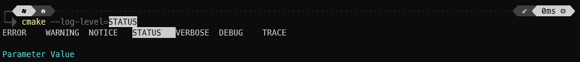
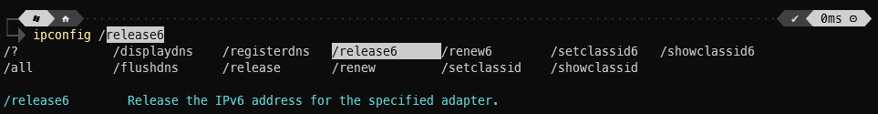
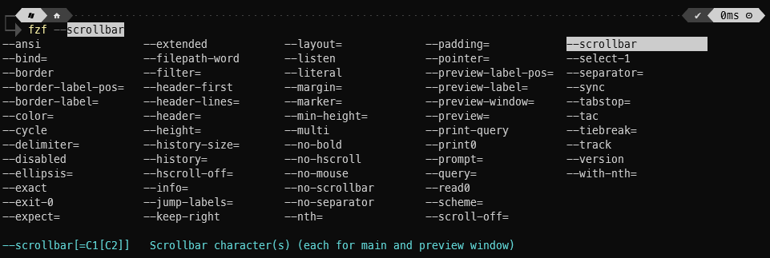
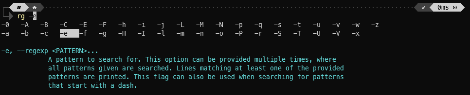

# PowerShell Tab-Completions

## Description

This repository provides tab-completion functionality to a suite of CLI programs
in PowerShell. Many of these leverage the [HelpParser](https://github.com/jjcarrier/HelpParser)
module to parse a command's help documentation for options and flags, while
others may simply hook into the command's built-in tab-completion interfaces.

## Installation

Clone the repo:

```pwsh
git clone git@github.com:jjcarrier/PSTabCompletions.git
cd PSTabCompletions
```

Install dependencies from `PSGallery`:

```pwsh
Install-Module -Name "posh-git" -Repository PSGallery
Install-Module -Name "HelpParser" -Repository PSGallery
```

On Windows, another module is required for the `wsl` command.

```pwsh
Install-Module -Name "WSLTabCompletion" -Repository PSGallery
```

> **Note**
> While `HelpParser` could provide tab completion for these commands, these
  dedicated solutions offer a more complete experience and is recommended over
  the more general purpose `HelpParser` tab completion functionality.

Add the module to your `$PROFILE`:

```pwsh
Import-Module ./TabCompletions.psm1
```

## PSReadLine

For full featured (tab)completion it is recommended to enable PSReadLine, this
may already be installed on the system, but it can be installed/updated from
PSGallery.

```pwsh
Install-Module -Name "PSReadLine" -Repository PSGallery
```

The following a recommended configuration that can be added to `$PROFILE`. The
last line being the most essential setting.

```pwsh
Set-PSReadLineOption -HistoryNoDuplicates:$true
Set-PSReadLineOption -PredictionSource HistoryAndPlugin
Set-PSReadLineKeyHandler -Function AcceptNextSuggestionWord -Chord Ctrl+Shift+RightArrow
Set-PSReadLineKeyHandler -Key UpArrow -Function HistorySearchBackward
Set-PSReadLineKeyHandler -Key DownArrow -Function HistorySearchForward
Set-PSReadlineKeyHandler -Key Tab -Function MenuComplete
```

### Examples

An example using parameter value completion:


An example using a program that uses Win32/MS-DOS style arguments:


Other examples of popular tools (one showing available options another showing
available flags):



## Additional Notes

The `HelpParser` module is still in an experimental state and thus there are
some known issues, but in most cases, these are minor. Please see this
repository's documentation for more information on its limitations and known
issues.
